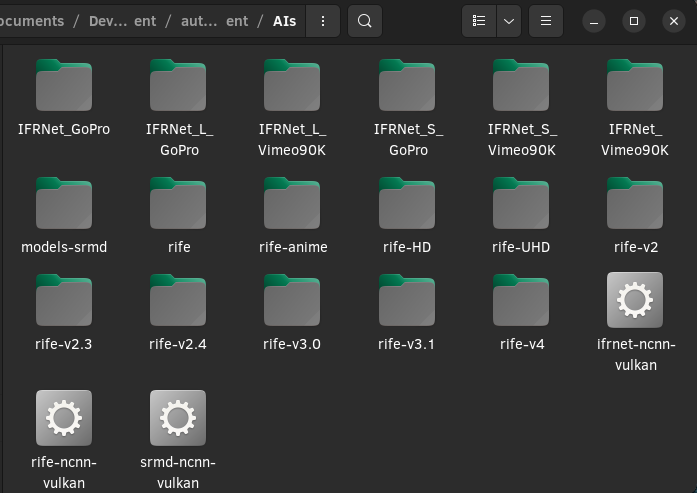

# Auto Video Enhancer
A script written in Python that automates the process of enhancing digital videos with the help of a few AIs. When the video is under a resolution of 720x480, or depending on your options, it will double the resolution with SRMD. Also, you can set a target frames per second in the options and RIFE will interpolate it. The video output will be encoded by ffmpeg with libx265.

### Note
Depending on your system and the video itself, it can take a very long time before one video is done. Make sure that you have a good system and patience.

## About RIFE and SRMD
### RIFE
RIFE is used to interpolate videos. In this case, it's used for videos that are more than 1080p.
For more information, feel free to go on hzwer's repository: https://github.com/megvii-research/ECCV2022-RIFE
Also, make sure to check out nihui's for vulkan support: https://github.com/nihui/rife-ncnn-vulkan

### SRMD
SRMD is used to add more resolution when needed.
For more information, feel free to go on cszn's repository: https://github.com/cszn/SRMD
Also, make sure to check out nihui's for vulkan support: https://github.com/nihui/srmd-ncnn-vulkan

## How to use
To get help
```bash
$ python3 main.py -h

main.py -i <input-file/folder> -o <output-file/folder>
-h to show argument help
-t to indicate where you want to create your temporary directory (To reduce wear on your storage)
-f to target a specific framerate. Defaults at 60. Cannot go more than 180.
-r if the specified resolution is under what you wrote in this format : <number>x<number> it will double the resolution. Defaults at 720x480
```

## Installation
### Dependencies
* Has only had been tested on Linux
* Python 3.11
  * opencv2
* ffmpeg
* Large storage device for temporary directory (optional but recommended)
* A relatively fast GPU and CPU

### Where to put stuff
* unpack the latest release https://github.com/nihui/rife-ncnn-vulkan/releases into the "AIs" directory
* unpack the latest release https://github.com/nihui/srmd-ncnn-vulkan/releases into the "AIs" directory
* unpack the latest release https://github.com/nihui/ifrnet-ncnn-vulkan/releases into the "AIs" directory

The directory should look like this:


# TODO
* Make it work on macOS
* Make it work on Windows
